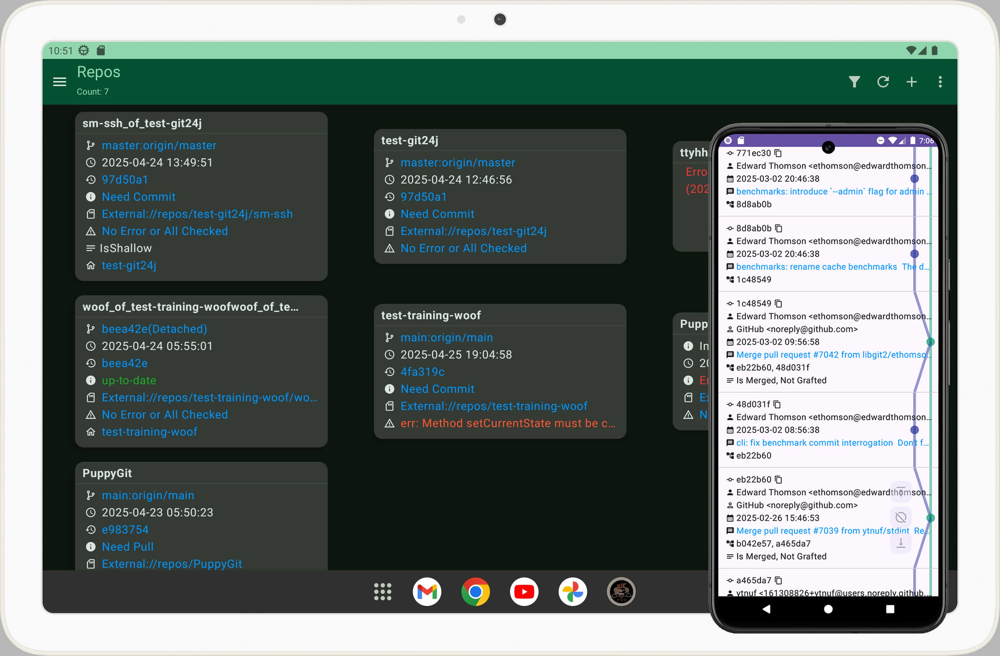

<a href="README_CN.md">简体中文</a>

# PuppyGit
PuppyGit is A Git Client for Android, Open Source and No Ads and Free to use

### PuppyGit is the first android git client which support graph view of commits history

## Author
PuppyGit made by Bandeapart1964 of catpuppyapp

### For a long time, nobody care android git users experience, all the clients are awful, but now have I care, that's why I create PuppyGit, all the git clients in the old days, they are gone with the wind, have a day, PuppyGit will gone as well, but for now, just enjoy it.
### Star + <a href=https://github.com/catpuppyapp/PuppyGit/blob/main/donate.md>Donate</a>, it will help me continuously maintenance this app!
### I appreciate every donator and user, especially donators! You give me faith! 
### I hope have a day I can got 1M users and many donators! XD


## Demo Video:
<a href=https://www.patreon.com/posts/puppygit-is-git-114679516>Clone A Repo</a> <br>
<a href=https://www.patreon.com/posts/obisidian-114681158>Obsidian + PuppyGit</a> <br>
<a href=https://www.patreon.com/posts/markor-puppygit-114681068>Markor + PuppyGit</a> <br>
<a href=https://www.patreon.com/posts/puppygit-preview-124623047>Markdown Preview</a> <br>
<a href=https://www.patreon.com/posts/puppygit-now-and-114680923>Switch DarkMode and Chinese</a><br>
<a href=https://www.patreon.com/posts/1-0-5-9v35-new-115069154>Resolve Conflicts/Squash Commits</a><br>
<a href=https://www.patreon.com/posts/puppygit-auto-122757321>Auto Sync Obsidian Vault</a><br>
<a href="https://www.patreon.com/posts/puppygit-tasker-122757862">PuppyGit + Tasker</a><br>


## Download
<a href="https://github.com/catpuppyapp/PuppyGit/releases" target="_blank">
    
</a>
<a href="https://apt.izzysoft.de/fdroid/index/apk/com.catpuppyapp.puppygit.play.pro" target="_blank">
    
</a>


###### PS:If you are an old user, maybe you was saw "PuppyGit Pro",and now it's disappeared, Don't worry, No Difference Of "PuppyGit Pro" and "PuppyGit", just changed the name for simple.


## PuppyGit + Notes App = A new way to sync your notes on Android!
Not only sync codes, You can use PuppyGit sync your notes repository create by note-taking apps like: <a href="https://github.com/obsidianmd/obsidian-releases">Obsidian</a> / <a href="https://github.com/gsantner/markor">Markor</a> or Other!

also see: <a href=https://www.patreon.com/posts/puppygit-auto-122757321>Auto Sync Obsidian Vault</a><br>

## Tasker
You can call PuppyGit by Tasker via Http Request, check the demo video: <a href="https://www.patreon.com/posts/puppygit-tasker-122757862">PuppyGit + Tasker</a><br>


## 2fa
If your github/gitlab or other platforms account enabled 2fa, you may need create a personal access token instead your password

see:<br>
<a href=https://docs.github.com/en/authentication/keeping-your-account-and-data-secure/managing-your-personal-access-tokens#creating-a-fine-grained-personal-access-token>github create personal access token</a><br>
<a href=https://docs.gitlab.com/ee/user/profile/personal_access_tokens.html#create-a-personal-access-token>gitlab create personal access token</a>


## Screenshots



## Features
- fetch
- merge
- pull
- push
- files explorer
- simple file editor (only utf8 supported)
- commit history (git log)
- shallow clone(git clone with depth)
- rebase
- cherry-pick
- patch
- reflog
- tags
- stashes
- remotes
- branches
- submodules
- squash commits
- reset
- resolve conflicts
- markdown preview
- auto pull/push when enter/exit specified apps(useful for auto sync note taking app like obsidian/markor)
- call pull/push/sync by tasker or other automation tools via http service


## About ssh
when first time connect to an unknown host, PuppyGit will ask you allow/reject as default, its more safety, also, if you want, you can allow unknown hosts by default, just checkout the Settings page.
#### note: PuppyGit only require private key and passphrase for connect to remote repo by ssh, it doesn't support generate ssh keys, if you want to generate ssh keys on android, try another app of mine: <a href=https://github.com/catpuppyapp/PuppySshKeyMan/releases>Ssh Key Man</a>

## About signing commit/tag
see: https://github.com/catpuppyapp/PuppyGit/issues/4

## About PC version
see: https://github.com/catpuppyapp/PuppyGit/issues/11


## Build
import project to Android Studio, then build, that's all. (android NDK is required)
<br><br>
### if you want to build libs by your self
The <a href=https://github.com/catpuppyapp/PuppyGit/blob/main/.github%2Fworkflows%2Fbuild_libs_and_unsigned_apk.yml>workflow</a> describe how to build libs and the apk


## Security
I recommend every user set a master password, it will used to encrypt password/passphrase of your credentials, you can set it on Settings screen. If you don't set master password, will use a public default password encrypt your credential, it is not enough safe cause it is public and actually no way hidden it.


## Help translate
### if your language added
1. find the `strings.xml` in the `res/values-your_language_code`
2. update it
3. send pr 

### if your language not added
1. Download <a href="https://github.com/catpuppyapp/PuppyGit/blob/main/app/src/main/res/values/strings.xml">strings.xml</a>
2. Translate the file's values to your language, e.g.```<help>help translate</help>```to```<help>帮助翻译</help>```
3. Create an issue attaching the file you was translated, the issue should tell which language you translated to

Then I'll add your language into PuppyGit in further version, after added, if have new strings need translate, you can simple update existed `res/vlaues-your_language_code/strings.xml` in the PuppyGit project then send a pr to update it.

### NOTE
The string in strings.xml like "ph_a3f241dc_NUMBER" are place holders, the last NUMBER is order, e.g. a string resource ```<str1>name: ph_a3f241dc_1, age: ph_a3f241dc_2</str1>```, will replaced when running, it maybe will show as: ```"name: abc, age: 123"```, if you have mistake with the order number, e.g.```<str1>name: ph_a3f241dc_2, age: ph_a3f241dc_1</str1>```, it may cause app show wrong text like ```"name: 123, age: abc"```


## Comments in code
this project has many chinese comments, and some comments are out-of-date or nonsense, I have no plan clean them, but if you read the codes, and you wonder know some comments meaning, try translator or ask me is ok


## Credits
### Logo
The PuppyGit logo designed by Bandeapart1964(myself)<br>
The Git Logo in PuppyGit logo is created by Jason Long, is licensed under the Creative Commons Attribution 3.0 Unported License. (<a href=https://git-scm.com/downloads/logos>The Git Logo</a>)<br>

### Libs
The `libgit2.so` built from <a href=https://github.com/libgit2/libgit2/releases/tag/v1.9.0>libgit2 1.9.0</a>(<a href=https://raw.githubusercontent.com/libgit2/libgit2/main/COPYING>LICENSE</a>)<br>
The `libssh2.so` built from <a href=https://github.com/libssh2/libssh2/releases/tag/libssh2-1.11.1>libssh2 1.11.1</a>(<a href=https://github.com/libssh2/libssh2/blob/master/COPYING>LICENSE</a>)<br>
The `libgit24j.so`'s source code is edited from <a href=https://github.com/git24j/git24j>Git24j</a> and <a href=https://github.com/Frank997/git24j>A fork of Git24j</a>(<a href=https://raw.githubusercontent.com/git24j/git24j/master/LICENSE>LICENSE</a>)(I've sent pr after I made changes and tested)<br>
The `libcrypto.so` and `libssl.so` built from <a href=https://github.com/openssl/openssl/releases/tag/openssl-3.4.0>openssl 3.4.0</a>(<a href=https://raw.githubusercontent.com/openssl/openssl/master/LICENSE.txt>LICENSE</a>)<br>
The Editor of PuppyGit is modified from kaleidot725's <a href=https://github.com/kaleidot725/text-editor-compose>text-editor-compose</a>(<a href=https://raw.githubusercontent.com/kaleidot725/text-editor-compose/main/LICENSE>LICENSE</a>)

### Other Files
The Log class `MyLog` changed from: <a href=https://www.cnblogs.com/changyiqiang/p/11225350.html>changyiqiang's blog</a><br>
The `MIMEType` related util classes copied from ZhangHai's <a href=https://github.com/zhanghai/MaterialFiles>Material Files</a>(<a href=https://github.com/zhanghai/MaterialFiles/blob/master/LICENSE>LICENSE</a>)<br>
The function `FsUtil.openFileEditFirstIfFailedThenTryView()` origin version copied from <a href=https://github.com/maks/MGit/blob/66ec88b8a9873ba3334d2b6b213801a9e8d9d3c7/app/src/main/java/me/sheimi/android/utils/FsUtils.java#L119C24-L119C32>MGit FsUtil.openFile()</a>(<a href=https://github.com/maks/MGit/blob/master/COPYING>LICENSE</a>)<br>
The `PermissionUtils` copied from <a href=https://github.com/NeoApplications/Neo-Backup/blob/main/src/main/java/com/machiav3lli/backup/utils/PermissionUtils.kt>Neo-Backup PermissionUtils class</a>(<a href=https://github.com/NeoApplications/Neo-Backup/blob/main/LICENSE.md>LICENSE</a>)

