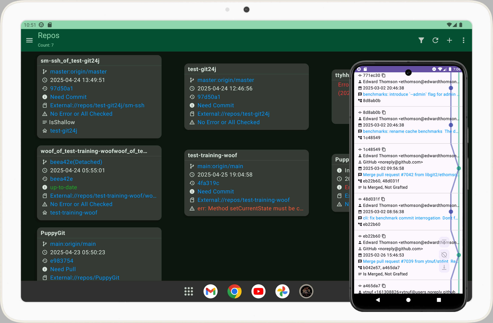

# 小狗Git
小狗Git 是一个安卓Git客户端，免费开源无广告


## 作者
小狗Git由catpuppyapp的Bandeapart1964倾情奉献

### 加星标并<a href=https://github.com/catpuppyapp/PuppyGit/blob/main/donate.md>捐赠</a>以给贫穷的开发者提供支持！这有助于此app持续维护！
### 感谢每个捐赠者和用户，尤其是捐赠者！
### 希望有一天能获得百万用户和很多捐赠！XD


## 演示视频:
<a href=https://www.patreon.com/posts/puppygit-is-git-114679516>克隆仓库</a> <br>
<a href=https://www.patreon.com/posts/obisidian-114681158>同步Obsidian笔记</a> <br>
<a href=https://www.patreon.com/posts/markor-puppygit-114681068>同步Markor笔记</a> <br>
<a href=https://www.patreon.com/posts/puppygit-preview-124623047>Markdown预览</a> <br>
<a href=https://www.patreon.com/posts/puppygit-now-and-114680923>切换暗黑模式和中文</a><br>
<a href=https://www.patreon.com/posts/1-0-5-9v35-new-115069154>解决冲突、整合提交</a><br>
<a href=https://www.patreon.com/posts/puppygit-auto-122757321>自动同步Obsidian笔记仓库</a><br>
<a href="https://www.patreon.com/posts/puppygit-tasker-122757862">和Tasker协作</a><br>


## 下载
<a href="https://github.com/catpuppyapp/PuppyGit/releases" target="_blank">
    
</a>
<a href="https://apt.izzysoft.de/fdroid/index/apk/com.catpuppyapp.puppygit.play.pro" target="_blank">
    
</a>


###### PS:如果你是老用户，可能发现app名字里少了 pro，功能没差别，只是简化了名字


## 小狗Git + 笔记app = 全新的跨平台同步笔记方案！
小狗Git不仅能同步代码，还能同步笔记，支持基于文件的笔记软件，例如: <a href="https://github.com/obsidianmd/obsidian-releases">Obsidian</a> / <a href="https://github.com/gsantner/markor">Markor</a> 等。

相关: <a href=https://www.patreon.com/posts/puppygit-auto-122757321>自动同步Obsidian笔记仓库</a><br>

## Tasker
Tasker可通过Http请求调用小狗Git执行操作，演示视频： <a href="https://www.patreon.com/posts/puppygit-tasker-122757862">小狗Git + Tasker</a><br>


## 2fa
如果你的github/gitlab或其他git平台的账号启用了两步验证，你需要创建访问令牌替代密码

相关链接:<br>
<a href=https://docs.github.com/en/authentication/keeping-your-account-and-data-secure/managing-your-personal-access-tokens#creating-a-fine-grained-personal-access-token>github create personal access token</a><br>
<a href=https://docs.gitlab.com/ee/user/profile/personal_access_tokens.html#create-a-personal-access-token>gitlab create personal access token</a>


## 截图



## 功能
- 下载（fetch）
- 合并
- 拉取
- 推送
- 文件浏览
- 文本编辑 (仅支持 utf8)
- 提交历史 (git log)
- 浅克隆(git clone with depth)
- 变基
- cherry-pick
- 补丁
- reflog
- 标签
- stashes
- remotes
- 分支管理
- 子模块
- squash commits
- reset
- 解决冲突
- markdown预览
- 进入退出app自动同步笔记
- 通过http service调用 pull/push/sync

## 文本编辑器
由于小狗Git的编辑器很简陋，而我也没有计划在近期内把它做大做强，所以我推荐一些好用的编辑器给你：

`Squircle CE` 代码编辑器: https://github.com/massivemadness/Squircle-CE

`Markor`, markdown 编辑器: https://github.com/gsantner/markor

安装之后可在小狗Git内通过“打开方式”并选择文本类型来启动它们。


## 关于 ssh
首次连接到未知主机时，小狗git将会询问是否允许连接，这样更安全，或者如果你觉得麻烦，可前往设置页面启用默认允许所有连接。
#### 注意: 小狗Git仅需要私钥和passphrase就足够建立ssh连接，并不需要公钥，也不支持生成ssh密钥对，如果你想在手机上生成ssh密钥，可尝试我的另一个app: <a href=https://github.com/catpuppyapp/PuppySshKeyMan/releases>Ssh Key Man</a>

## 关于签名提交和标签
看: https://github.com/catpuppyapp/PuppyGit/issues/4

## 关于pc版本
看: https://github.com/catpuppyapp/PuppyGit/issues/11


## 构建
导入仓库，构建。（需要安卓ndk，不过正常来说会自动下载）
<br><br>
### 如果你想自己构建依赖库
看下<a href=https://github.com/catpuppyapp/PuppyGit/blob/main/.github%2Fworkflows%2Fbuild_libs_and_unsigned_apk.yml>这个workflow</a>，其中描述了怎么构建依赖库


## 安全
因为小狗Git代码开源，所以其默认加密用户密码的密码也是公开的，所以建议前往设置页面设置个主密码，主密码会用来加密你的凭据的密码。


## 帮助翻译
### 若你的语言已经添加
1. 前往你的语言所在的目录 `res/values-your_language_code` 找到 `strings.xml` 
2. 更新翻译
3. 发 pr 

### 若你的语言未添加
1. 下载 <a href="https://github.com/catpuppyapp/PuppyGit/blob/main/app/src/main/res/values/strings.xml">strings.xml</a>
2. 翻译成你的语言，例如：```<help>help translate</help>```to```<help>帮助翻译</help>```
3. 创建issue，写上你的目标语言并附带你翻译的文件。

然后我会添加你的语言到小狗Git，日后若需要更新翻译，你可直接fork仓库并更新已存在的`res/vlaues-your_language_code/strings.xml`，然后发个pr。

### 注意
在 strings.xml 中像 "ph_a3f241dc_NUMBER" 之类的字符串是占位符，末尾的 "NUMBER" 代表顺序，例如： 字符串资源 ```<str1>name: ph_a3f241dc_1, age: ph_a3f241dc_2</str1>```，将在运行时被替换为实际的语言，可能是： ```"name: abc, age: 123"```，如果你把顺序搞错：```<str1>name: ph_a3f241dc_2, age: ph_a3f241dc_1</str1>```，则会变成 ```"name: 123, age: abc"```


## 代码中的注释
代码中有些注释有误但没更新，忽视即可。


## 鸣谢
### 图标
App图标由 Bandeapart1964(我自己)设计<br>
App图标中的 Git Logo 由 Jason Long 设计，受 Creative Commons Attribution 3.0 Unported License保护。 (<a href=https://git-scm.com/downloads/logos>The Git Logo</a>)<br>

### 库
The `libgit2.so` built from <a href=https://github.com/libgit2/libgit2/releases/tag/v1.9.1>libgit2 1.9.1</a>(<a href=https://raw.githubusercontent.com/libgit2/libgit2/main/COPYING>LICENSE</a>)<br>
The `libssh2.so` built from <a href=https://github.com/libssh2/libssh2/releases/tag/libssh2-1.11.1>libssh2 1.11.1</a>(<a href=https://github.com/libssh2/libssh2/blob/master/COPYING>LICENSE</a>)<br>
The `libgit24j.so`'s source code is edited from <a href=https://github.com/git24j/git24j>Git24j</a> and <a href=https://github.com/Frank997/git24j>A fork of Git24j</a>(<a href=https://raw.githubusercontent.com/git24j/git24j/master/LICENSE>LICENSE</a>)(I've sent pr after I made changes and tested)<br>
The `libcrypto.so` and `libssl.so` built from <a href=https://github.com/openssl/openssl/releases/tag/openssl-3.5.0>openssl 3.5.0</a>(<a href=https://raw.githubusercontent.com/openssl/openssl/master/LICENSE.txt>LICENSE</a>)<br>
The Editor of PuppyGit is modified from kaleidot725's <a href=https://github.com/kaleidot725/text-editor-compose>text-editor-compose</a>(<a href=https://raw.githubusercontent.com/kaleidot725/text-editor-compose/main/LICENSE>LICENSE</a>)

### 其他文件
The Log class `MyLog` changed from: <a href=https://www.cnblogs.com/changyiqiang/p/11225350.html>changyiqiang's blog</a><br>
The `MIMEType` related util classes copied from ZhangHai's <a href=https://github.com/zhanghai/MaterialFiles>Material Files</a>(<a href=https://github.com/zhanghai/MaterialFiles/blob/master/LICENSE>LICENSE</a>)<br>
The `PermissionUtils` copied from <a href=https://github.com/NeoApplications/Neo-Backup/blob/main/src/main/java/com/machiav3lli/backup/utils/PermissionUtils.kt>Neo-Backup PermissionUtils class</a>(<a href=https://github.com/NeoApplications/Neo-Backup/blob/main/LICENSE.md>LICENSE</a>)<br>
The files about syntax highlighting feature are picked from <a href=https://github.com/Rosemoe/sora-editor>Sora Editor</a>(<a href=https://github.com/Rosemoe/sora-editor/blob/main/LICENSE>LICENSE</a>)

